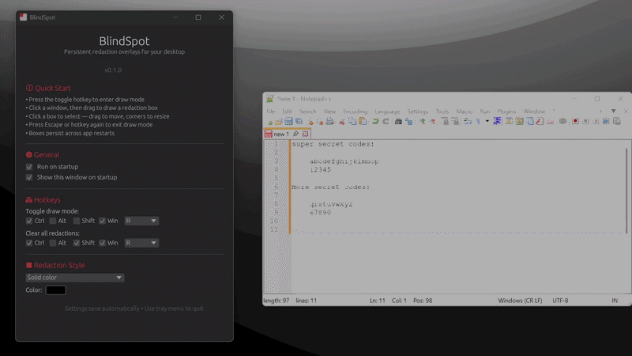
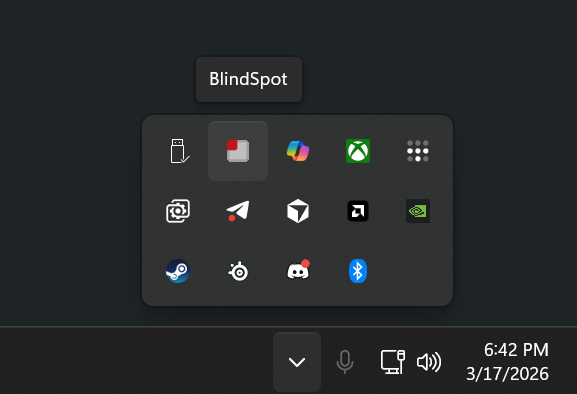
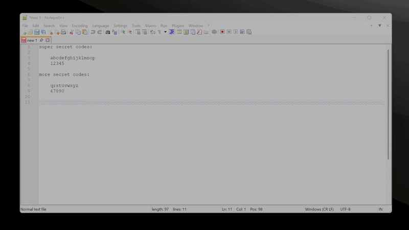

# BlindSpot

Redaction overlays for Windows. Draw boxes over anything on screen: they track the window as it moves and resizes.



---

## Download

1. Go to the [Releases page](https://github.com/RAZKOM/blindspot/releases)
2. Click the latest release
3. Under **Assets**, download `blindspot.zip` (or `blindspot.exe`)
4. Run it

Requires Windows 10 or 11.

---

## How it works

1. Press **Ctrl + Win + R** to enter draw mode
2. Click a window to target it
3. Drag to draw a box over what you want hidden
4. Press **Escape** — done

The box will follow that window wherever it goes. Draw as many as you need.

**To edit:** press the hotkey again, click a box to select it. Drag to move, drag corners to resize, click the center X to delete.

**To clear everything:** Ctrl + Win + Shift + R

**To exit app** Open your system tray and simply right click the icon to open its menu. Press Quit.


---

## Features



- Tracks window movement, resizing, minimize, and snap in real time
- Smart corner anchoring — boxes stay correctly positioned when windows resize
- Three fill styles: solid color, animated noise/static, or a custom image
- Configurable hotkeys and redaction style
- Runs on startup (optional)
- Runs in background with almost 0% utilization until needed.

---

## Build from source

```powershell
# Requires Rust stable + MSVC build tools
cargo build --release
```

Output: `target/release/blindspot.exe`

---

## License

MIT — free to use, modify, and distribute.
